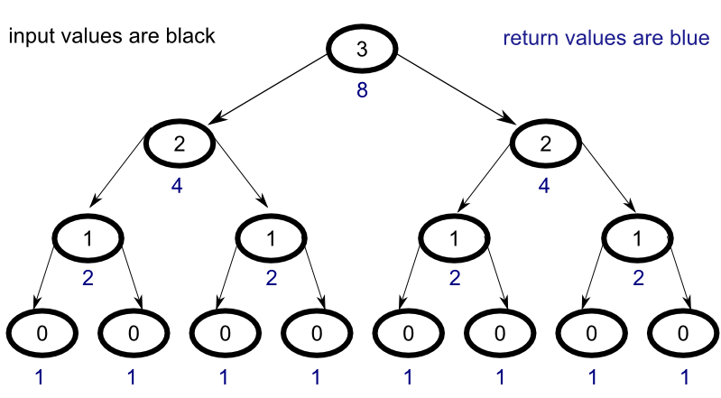

To better understand how memoization works with Haskell's lazy evaluation, let's walk through a simple example step by step. As a learning tool, we'll create a simple function that raises the number two to a the power of whatever number is given as input. Let's begin with a naive implemenation to get a better idea of what's going on.

### Naive Implementation

Consider the following [code](https://github.com/jonathanmann/memoization_in_haskell/blob/master/naive_recursive_two_to_the_power.hs) :
<small>

naive_recursive_two_to_the_power :: Int -> Integer
naive_recursive_two_to_the_power 0 = 1
naive_recursive_two_to_the_power n = naive_recursive_two_to_the_power(n-1) + naive_recursive_two_to_the_power(n-1)

</small>
Let's walk through the code line by line.
naive_recursive_two_to_the_power :: Int -> Integer
The first line indicates that the function "naive_recursive_two_to_the_power" will take in datatype Int and return the datatype Integer. The difference between these two datatypes has to do with the maximum size of the integer that the datatype can store. For our purposes, you can simply think of both types as integers, but a detailed explanation can be found [here](http://stackoverflow.com/questions/17766424/dubious-int-vs-integer-handling-in-haskell).
naive_recursive_two_to_the_power 0 = 1
The second line establishes the base case. Whenever the value 0 is passed to the function, the value 1 is returned.
naive_recursive_two_to_the_power n = naive_recursive_two_to_the_power(n-1) + naive_recursive_two_to_the_power(n-1)
The final line gives instructions for what the function should return for any number "n" not in the base case. Here the function calls itself recursively for the (n - 1) case until the base case is reached and adds the returned value to another instance of the (n - 1) case.

As an example, let's walk through what happens when we input the number 3 into the function. During the tracing process, we will skip the first line since it simply tells the function what to expect.

naive_recursive_two_to_the_power 3

Since the input does not match the base case, the final line is evalutated:

naive_recursive_two_to_the_power 3 = naive_recursive_two_to_the_power(3-1) + naive_recursive_two_to_the_power(3-1)


In order to find the solution, we must now resolve the following function:

naive_recursive_two_to_the_power (3-1)


which is equivalent to


naive_recursive_two_to_the_power 2


Following the same steps with an input of 2, we arrive at the following : 


naive_recursive_two_to_the_power 2 = naive_recursive_two_to_the_power(2-1) + naive_recursive_two_to_the_power(2-1)


Similarly, with an input of 1, we arrive at the following : 


naive_recursive_two_to_the_power 1 = naive_recursive_two_to_the_power(1-1) + naive_recursive_two_to_the_power(1-1)


Now we're onto something though, because when we pass the input value 0 into our function, the base case is satisfied, and the function returns the value 1. 

Now that we have gotten to the bottom of things, the solution can propagate back up the chain, but since this is a naive implementation, every recursive call must be evaluated all the way down to its base case (or one of its base cases if more than a single base case is defined) in order to return a value.

To get a clearer picture of what is going on, consider the diagram below:

### Tables

Aenean lacinia bibendum nulla sed consectetur. Lorem ipsum dolor sit amet, consectetur adipiscing elit.

<table>
  <thead>
    <tr>
      <th>Name</th>
      <th>Upvotes</th>
      <th>Downvotes</th>
    </tr>
  </thead>
  <tfoot>
    <tr>
      <td>Totals</td>
      <td>21</td>
      <td>23</td>
    </tr>
  </tfoot>
  <tbody>
    <tr>
      <td>Alice</td>
      <td>10</td>
      <td>11</td>
    </tr>
    <tr>
      <td>Bob</td>
      <td>4</td>
      <td>3</td>
    </tr>
    <tr>
      <td>Charlie</td>
      <td>7</td>
      <td>9</td>
    </tr>
  </tbody>
</table>

Nullam id dolor id nibh ultricies vehicula ut id elit. Sed posuere consectetur est at lobortis. Nullam quis risus eget urna mollis ornare vel eu leo.

-----

Want to see something else added? <a href="https://github.com/poole/poole/issues/new">Open an issue.</a>
