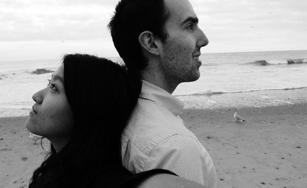

I grew up in [Jericho, Vermont](http://www.jerichovt.gov/), graduated from [SUNY New Paltz](http://www.newpaltz.edu/) in Economics, and, in late 2009, married Ruolin (Sarah) Cui in Boston, Massachusetts.

In 2012, we moved to New York from DC, where we had been working as consultants. For the first several years in New York, I worked as a data scientist at the securities class action firm [Labaton Sucharow](http://labaton.com/) where I developed custom applications and create models and algorithms to look for corporate malfeasance.

Today, I work as a data scientist for [JP Morgan Chase & Co](https://www.jpmorganchase.com/), and my wife is a director at [Mokobio](http://mokobio.com/), a Chinese biotech company.

I frequently help friends and family with their side programming / data mining projects, so feel free to reach out to me if you have an interesting project you would like help with. I am a member of [the New York Python Meetup Group](http://www.meetup.com/nycpython/), and an eager learner of Haskell.
